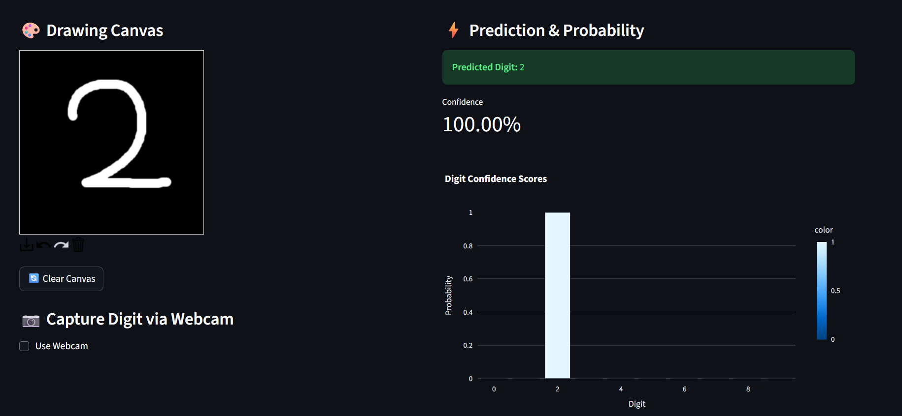
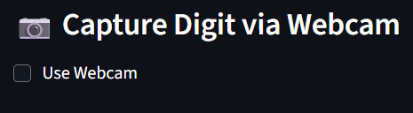
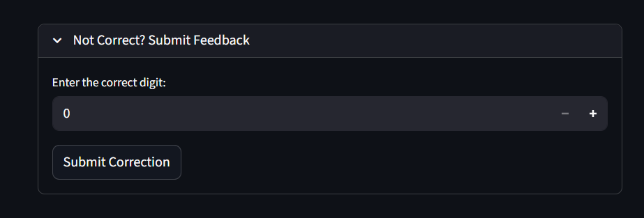

# 🧠 Handwritten Digit Recognition

## 🧩 Overview
-This project demonstrates an end-to-end deep learning pipeline for recognizing handwritten digits similar to the MNIST dataset.
-Built using TensorFlow CNNs and a sleek Streamlit interface, it allows you to:
- Draw digits on a canvas ✍️  
- Capture digits via webcam 📷  
- Get instant predictions with confidence scores ⚡  
- Log feedback for continuous model improvement 🔄  
- View analytics dashboards 📊 (accuracy, confusion matrix)

## ⚙️ Tech Stack
### Frontend/UI
- 🖥️ Streamlit — Interactive web app framework
- 🎨 Streamlit DrawCanvas — Digit drawing interface
### Backend & Model
- 🧠 PyTorch — Deep learning model training and inference
- 🧮 NumPy, OpenCV — Image preprocessing and transformations
### Data & Analytics
- 📊 Pandas — CSV data logging and processing
- 📈 Seaborn & Matplotlib — Data visualization
- 🗃️ CSV-based logging system (extendable to SQL or NoSQL DB)

## 🌟 Features
- Real-time Digit Prediction — Draw a digit and get instant prediction with confidence.
- Prediction Logging — Every input and prediction is logged with timestamp, confidence, and feedback.
- Analytics Dashboard — Visualize model performance and user input trends.
- Confusion Analysis — Heatmap showing which digits are most often confused.
- Accuracy Monitoring — Track daily accuracy trends from feedback logs.
- Lightweight & Portable — No heavy dependencies beyond core ML and visualization libs.

## 📁 Project Structure
```
Handwritten_Digit_Recognition/
├── app/
│ ├── pycache/
│ ├── init.py
│ ├── app.py
│ ├── logger.py
│ ├── main.py
│ └── utils.py
├── notebooks/
│ ├── models/
│ │ └── mnist_cnn.h5
│ └── data_prep.ipynb
├── screenshots/
│ ├── Feedback.png
│ ├── Webcam.png
│ └── writing-prediction.png
├── venv/
├── .gitignore
├── feedback_logs.csv
├── README.md
└── requirements.txt
```

## 🧾 Analytics & Logging
- Every user interaction is logged in data/feedback_logs.csv with columns:
- timestamp	            input_type	  digit_predicted	 confidence 	digit_actual
- 2025-10-23T14:03:12	  canvas	         7	           0.982	       7
- 2025-10-23T14:05:47	  canvas	         3	           0.753	       5

## 📈 Dashboard

**Modules Used:**
- `pandas` for loading and grouping data
- `matplotlib` and `seaborn` for plotting
- `streamlit` for interactivity

**Displayed Metrics:**
- ✅ Overall Accuracy
- 🔥 Most Confused Digits (Heatmap)
- 📅 Accuracy Over Time (Line Chart)
- 📊 Prediction Summary Statistics

## 🖼️ Screenshots
- This document showcases the key features of the Handwritten Digit Recognition application.

### Writing Prediction

- This feature allows users to draw a digit (0-9) directly on the canvas. The application uses a pre-trained machine learning model to predict the digit in real-time. The predicted number is displayed prominently below the drawing area. 

### Webcam Feature  

- The application can also capture live video feed from your webcam. You can hold a handwritten digit up to the camera, and the system will process the video frames to identify and display the recognized digit. This demonstrates the model's capability to work with real-world input.

### Feedback System

- To help improve the model's accuracy, a feedback system is integrated. If a prediction is incorrect, the user can select the correct digit from a list. This feedback data can be collected and used for further training and refining the machine learning model.

## 🧑‍💻 Developer
- Rohit Ranjan Kumar
- B.Tech Computer Science, Manipal University Jaipur
- Passionate about Machine/Deep Learning, AI Systems, Computer Vision, and DSA
- 📧 Contact Me

Copyright (c) 2025 Rohit